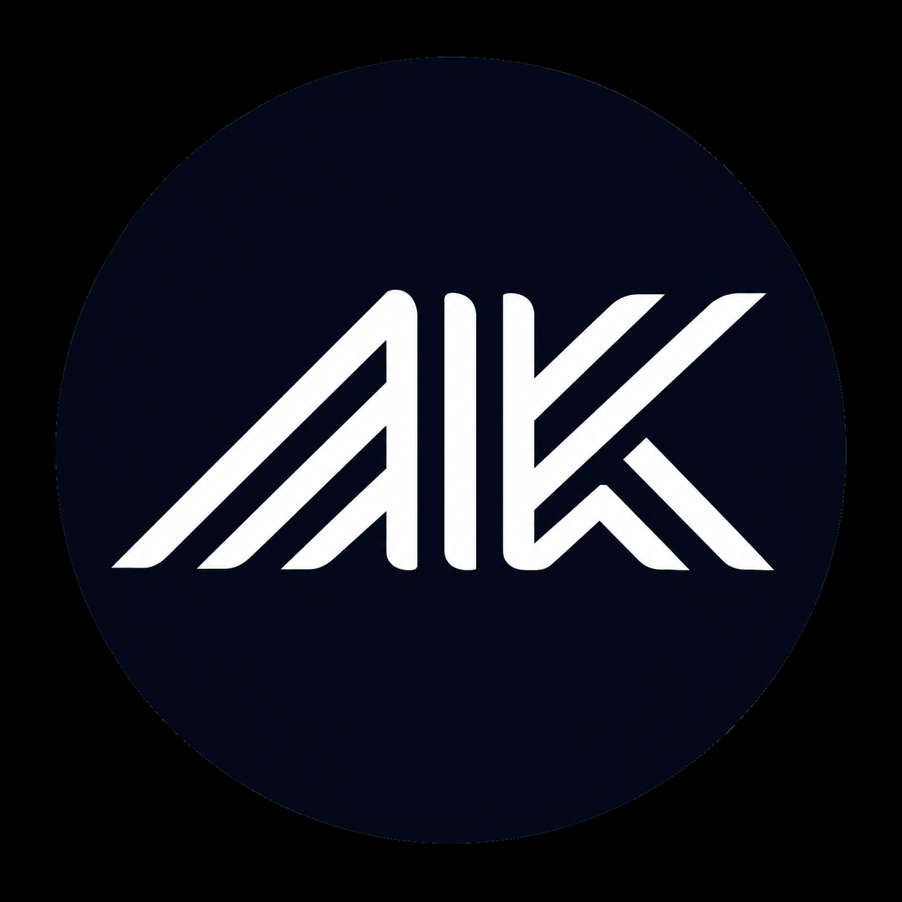

<!-- ========================================================= -->
<!--                    AMIT KUMAR PROFILE                     -->
<!-- ========================================================= -->

<!-- ===================== ANIMATED HEADER =================== -->

  

<!-- ===================== TYPING ANIMATION ================== -->

  

<!-- ======================== LOGO ============================ -->

  

<!-- ====================== INTRODUCTION ===================== -->

<h1 align="center">
  👋 Hey, I'm Amit Kumar
</h1>

  <strong>
    Full Stack Developer • CSE Student • Problem Solver
  </strong>

  I build modern web applications, learn by building,
  and turn ideas into real-world products.

  

 

<!-- ======================== ABOUT ME ======================== -->

<h2 align="center">⚡ ABOUT ME</h2>

  🎓 Computer Science & Engineering Student
    
  💻 Full Stack Developer
    
  🧠 Data Structures & Algorithms Enthusiast
    
  🚀 Building real-world applications
    
  🌱 Learning something new every day

 

<!-- ======================= TECH STACK ====================== -->

<h2 align="center">🛠️ TECH STACK</h2>

 

<!-- ======================= WHAT I BUILD ==================== -->

<h2 align="center">🚀 WHAT I BUILD</h2>

<table align="center">
<tr>

<td align="center" width="50%">

### 🌐 Full Stack Applications

Building responsive, functional and practical web applications.

</td>

<td align="center" width="50%">

### 🧠 Problem Solving

Improving programming logic through Data Structures & Algorithms.

</td>

</tr>

<tr>

<td align="center" width="50%">

### 💡 Real-World Projects

Turning ideas into working products instead of only following tutorials.

</td>

<td align="center" width="50%">

### 🚀 Continuous Growth

Learning modern technologies and improving software engineering skills.

</td>

</tr>
</table>

 

<!-- ===================== CURRENT FOCUS ===================== -->

<h2 align="center">🎯 CURRENTLY FOCUSING ON</h2>

🔹 Full Stack Development
 
🔹 Data Structures & Algorithms
 
🔹 Java & Python
 
🔹 React & Modern Web Development
 
🔹 Building Real-World Projects

 

<!-- ===================== GITHUB ACTIVITY =================== -->

<h2 align="center">📈 GITHUB ACTIVITY</h2>

 

<!-- ======================= SNAKE ============================ -->

<h2 align="center">🐍 CONTRIBUTION SNAKE</h2>

<picture>
  <source
    media="(prefers-color-scheme: dark)"
    srcset="https://raw.githubusercontent.com/missioncs2029-eng/missioncs2029-eng/output/github-contribution-grid-snake-dark.svg"
  />

  <source
    media="(prefers-color-scheme: light)"
    srcset="https://raw.githubusercontent.com/missioncs2029-eng/missioncs2029-eng/output/github-contribution-grid-snake.svg"
  />

  
</picture>

 

<!-- ===================== GITHUB STATS ====================== -->

<h2 align="center">📊 GITHUB STATS</h2>

 

<!-- ====================== CONNECT ========================== -->

<h2 align="center">🌐 CONNECT WITH ME</h2>

&nbsp;

 

<!-- ===================== DEVELOPER MINDSET ================= -->

<h2 align="center">💭 DEVELOPER MINDSET</h2>

<strong>
Learn → Build → Break → Fix → Improve
</strong>

  <i>
    Don't just learn technology. Build with it.
  </i>

 

<!-- ===================== FOOTER ============================= -->

  

