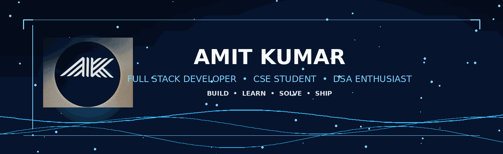

 

 

  

<table>
<tr>
<td align="center" width="150">🎓 <b>CSE Student</b></td>
<td align="center" width="150">💻 <b>Full Stack Dev</b></td>
<td align="center" width="150">🧠 <b>DSA Enthusiast</b></td>
<td align="center" width="150">🚀 <b>Builder</b></td>
</tr>
</table>

 

## 📌 About

<table>
<tr>
<td width="60%" valign="top">

I'm a **Computer Science Engineering student** who loves turning raw ideas into real, working software. My focus is **full stack development** — building things people can actually use — backed by a steady habit of sharpening problem-solving through **DSA**.

I care about clean, scalable code and systems that hold up outside a demo. Always learning, always shipping, always up for the next real-world project.

</td>
<td width="40%" valign="top">

<table>
<tr><td>🎯</td><td><b>Focus</b></td><td>Full Stack Development</td></tr>
<tr><td>🔨</td><td><b>Building</b></td><td>Modern web applications</td></tr>
<tr><td>🧠</td><td><b>Sharpening</b></td><td>DSA & problem-solving</td></tr>
<tr><td>🤝</td><td><b>Status</b></td><td>Open to collaboration</td></tr>
</table>

</td>
</tr>
</table>

 

## 🧰 Tech Arsenal

<table align="center">
<tr>
<td align="center" valign="top" width="25%">

**Languages**

</td>
<td align="center" valign="top" width="25%">

**Frontend**

</td>
<td align="center" valign="top" width="25%">

**Backend & DB**

</td>
<td align="center" valign="top" width="25%">

**Tooling**

</td>
</tr>
</table>

 

## 🚀 Featured Projects

<table align="center" width="100%">
<tr>
<td width="33%" valign="top">

### 🤖 [CampusDev](https://github.com/missioncs2029-eng/campusdev-bot)
Telegram bot platform for student project development services.

</td>
<td width="33%" valign="top">

### 🛠️ [CampusFix](https://github.com/missioncs2029-eng/CampusFix)
Campus-focused utility project built for real student needs.

</td>
<td width="33%" valign="top">

### 📅 [ClassPulse](https://github.com/missioncs2029-eng/classpulse)
College companion app — timetable, attendance & tasks.

</td>
</tr>
</table>

`Full-stack web apps`  ·  `DSA-driven problem solving`  ·  `Utility bots & tools`  ·  `CSE coursework projects`

 

## 📊 GitHub Analytics

  

  

 

### 🐍 Contribution Snake

 

## 🏆 Trophy Case

 

## 🎯 Current Focus

🔭 Deepening skills in **Full Stack Development**
🌱 Strengthening **Data Structures & Algorithms**
🤝 Open to collaborating on real-world web projects

 

## 📬 Connect

 

 

**𝗔𝗠𝗜𝗧 𝗞𝗨𝗠𝗔𝗥** · Full Stack Developer · CSE Student

*"Turning ideas into systems, one line at a time."*

